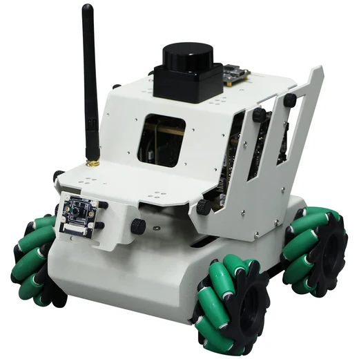

Overhaul and expansion of the software originally shipped with the RDK X3 Robot (http://www.yahboom.net/study/RDK-X3-Robot).

For the complete list of hardware and software changes, see the project website: https://marco-conciatori-public.github.io/

There you will also find all the robot capabilities with videos and explanations.
Finally, there is a step-by-step guide on how to recreate the robot from scratch.

# Hardware Modifications
- My current robot uses a bigger chassis "Pendulous Mecanum wheel chassis (L)" (https://category.yahboom.net/collections/a-chassis-bracket/products/ros-chassis), which allows for more space for the components. It is also necessary to fit the robotic arm. 
- the robotic arm DOFBOT-JetsonNANO (http://www.yahboom.net/study/Dofbot-Jetson_nano).
- the Nvidia Jetson Nano 4GB (https://developer.nvidia.com/embedded/jetson-nano-developer-kit) that comes with the robotic arm.
- a Coral USB Accelerator (https://coral.ai/products/accelerator/) for running the YOLO object detection model faster (from >20 seconds to 2~3 seconds per image).
- a microphone able to detect the Direction of Arrival (DoA) of the sound (https://wiki.seeedstudio.com/ReSpeaker_Mic_Array_v2.0/). To set the correct angle between the microphone and the robot see sunriseRobot/app_SunriseRobot/info/microphone_orientation.png.
- a red and green LED to indicate the robot's status during various operations.
- two 2-pin buttons to be able to perform important operations without the need for a joystick (e.g. to switch between Wi-Fi and hotspot).
- the LED and buttons are connected to the GPIO pins of the rdk expansion board, details can be found in
  - sunriseRobot/app_SunriseRobot/info/40_pin_meaning.png
  - sunriseRobot/app_SunriseRobot/info/40_pin_position.jpg
  - sunriseRobot/app_SunriseRobot/info/GPIO_pin_connections.pptx

# VR Connection
- The "src" folder contains ROS2 packages (robot-side) for connecting to the robot to a VR headset via Wi-Fi or hotspot. For ease of work, it is part of the main project, but for it to actually work, the following steps are necessary:
  - Clone/copy the project on the robot.
  - Copy/move "scr" to "root/marco_ros2_ws/src" (you can change the path, but you have to also update the files sunriseRobot/script_launchers/start_ros2.sh and sunriseRobot/script_launchers/start_ros2_no_gui.sh).
  - Build it with ROS2 commands:
    - cd /root/marco_ros2_ws/
    - rosdep install -i --from-path src --rosdistro foxy -y --ignore-src
    - colcon build
  - Repeat the above steps on the robot after each change to the "src" folder.
- The connection allows the user to control the robot using the VR gamepads, as well as view the robot's camera feed in AR.
- The VR-side connection is implemented in Unity (the "RobotVR.apk" file). It can be directly installed on the VR device. It was built and tested only for Meta Quest 3 (https://www.meta.com/it/en/quest/quest-3/).

# Main Application
The "sunriseRobot" folder contains the main application for controlling the robot. It is built in python, and it has been greatly changed from the original.
To enable the autostart of the application when the robot is turned on, you have to
- remove/disable the original app
- clone/copy the project on the robot
- install missing libraries
- copy/move sunriseRobot/script_launchers/start_robot_control.desktop and sunriseRobot/script_launchers/start_robot_control_no_gui.desktop to the autorun folder.
- make the files executable (chmod +x start_robot_control.desktop and chmod +x start_robot_control_no_gui.desktop)
- you can manually start the application by running the script sunriseRobot/script_launchers/start_robot_control.sh or sunriseRobot/script_launchers/start_robot_control_no_gui.sh

## Features
- Control robot via wireless Joystick included with the robot.
- Since the number of buttons is limited, the robot has modes and sub-modes, in which the buttons are mapped to different functions. For a complete list of button-functions pairs, see the "sunriseRobot/info/joystick_key_map.pptx.pdf" file.
- Use lidar for obstacle avoidance when controlling the robot with the joystick and to understand if it reached the target in autonomous (vision) mode.
- Search for user-defined objects using YOLOv11 model.
- Follow sounds using the microphone and the DoA algorithm.
- Robust: if a hardware component is missing (like the camera or the microphone), the robot will still work, but with limited functionality. This is also implemented for some of the libraries.
- The robot can switch between connecting to Wi-Fi or creating a hotspot, so that other devices can find it even if there are no networks in the area.
- Control the robotic arm to grab things.

## Modes and Sub-modes:
- MODE "user_controlled": the robot does nothing by itself, it only waits for commands from the user.
  - SUB-MODE "wheels": the user moves the robot around. with the Mecanum wheels, it can rotate in place and translate perpendicularly to its orientation.
  - SUB-MODE "arm_fk": (Forward Kinematics) the user can control the robotic arm by commanding each joint directly. With a 6-DOF arm, it is not easy.
  - SUB-MODE "arm_ik": (Inverse Kinematics) the user can control the robotic arm by commanding the end-effector position. The robot will calculate the joint angles to reach the desired position. It is slow because the computer cannot calculate the angles fast enough, 

# Notes
the folders "library_ws_src" and "yahboomcar_ws_src" are there because they are present on the robot and it was very helpful to have them in the project. They are not used in the main application, but they can be useful for reference or for future development.
